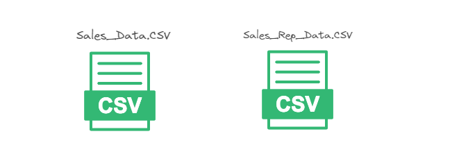
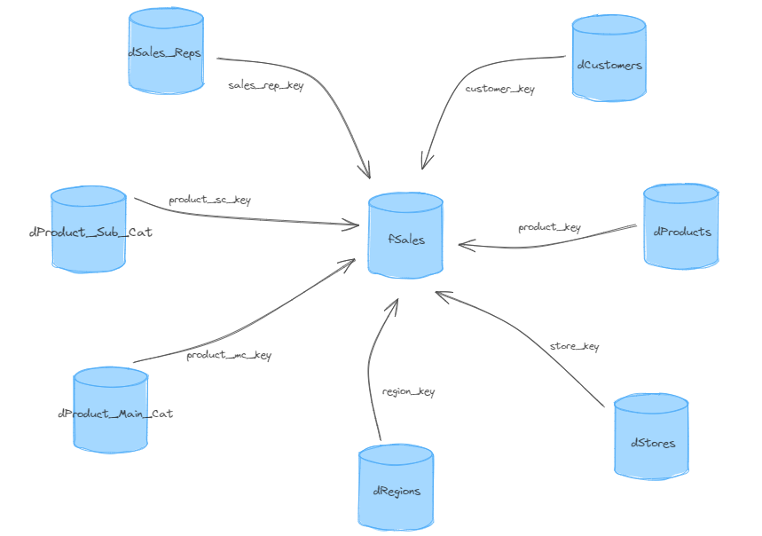

## Projeto de Engenharia de Dados - Retail Dynamics

### Visão Geral do Projeto
Este é um projeto de Engenharia de Dados para a **Retail Dynamics**, uma empresa fictícia de varejo que opera em diversas regiões dos Estados Unidos. O objetivo principal é transformar dados de vendas e representantes de vendas de um banco de dados relacional para um modelo estrela em um banco de dados PostgreSQL. Este modelo é então visualizado usando Power BI para gerar dashboards informativos para os stakeholders da empresa.

### Dados de Origem
O projeto utiliza dois arquivos CSV principais:
1. **Sales_Data.csv**: Contém transações de vendas detalhadas, incluindo informações de clientes, produtos, lojas e representantes de vendas.
2. **Sales_Rep_Data.csv**: Contém informações sobre os representantes de vendas.

Esses arquivos de dados são fornecidos mensalmente pelos departamentos de TI e Vendas da Retail Dynamics e armazenados em um banco de dados PostgreSQL para análise posterior.

### Objetivos do Projeto
Os principais objetivos do projeto são:
- Transformar os dados de vendas de um modelo relacional para um modelo dimensional (estrela) no PostgreSQL.
- Carregar os dados transformados em tabelas de fatos e dimensões.
- Visualizar os dados transformados utilizando Power BI para gerar dashboards interativos e informativos.

### Estrutura do Projeto

#### Estrutura Inicial

#### Estrutura Desejada

### Passos do Projeto

#### 1. Ingestão de Dados
Os dados são extraídos dos arquivos CSV e carregados em tabelas temporárias no PostgreSQL.

#### 2. Transformação de Dados
Os dados são transformados e carregados nas tabelas de dimensão e na tabela de fatos, conforme a modelagem dimensional (modelo estrela).

#### 3. Visualização dos Dados
Os dados transformados são visualizados utilizando o Power BI, criando dashboards interativos que ajudam a empresa a analisar o desempenho de vendas e tomar decisões informadas.

### Conclusão
O projeto utiliza uma abordagem robusta para transformar dados brutos de vendas e representantes de vendas em insights valiosos. Através da modelagem dimensional e da visualização dos dados no Power BI, a empresa Retail Dynamics pode obter uma compreensão detalhada de suas operações de vendas e tomar decisões estratégicas para impulsionar o crescimento e a eficiência.

### Lições Aprendidas
- Uso de modelagem dimensional para organização eficiente de dados.
- Transformação de dados utilizando SQL.
- Uso de Excalidraw para desenhar e planejar meus projetos
- Criação de dashboards interativos no Power BI para visualização de dados.

### Próximos Passos
- Melhorar a automação do pipeline de dados.
- Integrar novas fontes de dados para expandir as análises.

---

**Nota:** Os dados utilizados nesse projeto são fictícios e foram criados para fins de demonstração de habilidades em Engenharia de Dados.
